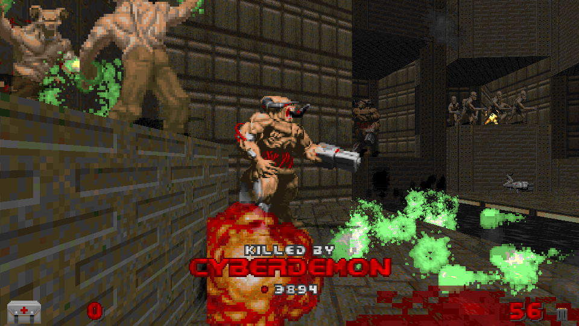

# FrameMe

FrameMe is a universal deathcam mod for GZDoom.

After the player dies, the map will freeze and the camera will zoom in on the
killer, displaying their name and health.

This mod should be multiplayer-compatible (given that it's the environment
where this mod would work best in (especially deathmatch)), but no extensive
testing has been done for it yet.